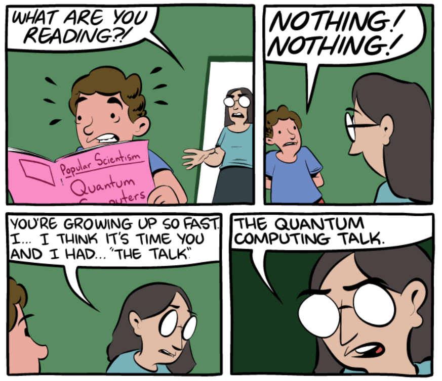

# M526/P623 Quantum Computation

<!--## Course blurb-->

  
 
  SMBC, <a href="https://www.smbc-comics.com/comic/the-talk-3"> "The Talk"</a> by Scott Aaronson and Zach Weinersmith

What does it mean to compute something, and how can we characterize computational efficiency? These questions lie at the heart of our algorithm-driven lives, influencing everything from automation to information security. Beyond these practical concerns, they also touch on profound philosophical questions about intelligence, creativity, and what makes us humans. (Is it CAPTCHA?) Implications of the theory of computation to such questions was [obvious to Turing himself](https://en.wikipedia.org/wiki/Computing_Machinery_and_Intelligence), but what he didn't anticipate was that quantum theory, if used as a foundation of information processing, would fundamentally transform our understanding of what is computationally feasible, shifting the boundary between what we consider easy and hard problems.

## Announcements

## Course information

This course is the second half of a year-long sequence on quantum information and computation given at the Institute for Fundamental Study (IF), Naresuan University, academic year 2024. The course will consist of (at most) 32 lectures, 1.5 hours each. The plan is to cover the following topics:

<!--For roughly the first half of the course, we'll put on our computer-scientist hats and examine computational thinking and kinds of algorithms we could run on a large-scale, error-free quantum computer. Then we’ll explore the fundamental idea required to build such a machine–quantum error correction–and, if time permits, discuss other computationally equivalent models of quantum computation and the ongoing quest to find concrete advantages of quantum computers over their classical counterparts. -->

- *Computational models*: Turing machine; undecidability; classical circuit model; reversible computing; most functions require expotential-size circuits; quantum circuit model; Solovay-Kitaev theorem; most unitaries require exponential-size circuits
- *Quantum algorithms*: quantum algorithms based on Fourier transform: Deutsch-Jozsa algorithm, Simon’s algorithm, quantum phase estimation (QPE), RSA cryptosystem, Shor's algorithm for factoring and discrete logarithms, hidden subgroup problem (HSP); Grover’s search algorithm
- *Quantum error correction*: classical linear codes; repetition codes and the Shor code; general properties of quantum error-correcting codes; stabilizer formalism; Gottesman-Knill theorem; basics of fault tolerance
- *Alternative models of quantum computation and limits to classical simulation of quantum computers*: (tentative) measurement-based quantum computation; complexity classes; reduction and hardness; quantum sampling advantage from postselection

No single textbook covers all the topics in this course. *Classical and Quantum Computation* by Kitaev, Shen, and Vyalyi comes close, though it can be quite mathematical and terse. 
For specific topics, I plan to incorporate materials from the following resources:
- [MM] Cristopher Moore and Stephan Mertens, *The Nature of Computation*, Oxford University Press, 2011 [Algorithms and complexity classes]
- [NC] Michael Nielsen and Isaac Chuang, *Quantum Computation and Quantum Information*, Cambridge University Press, 2000 [Circuit models]
- [Pre] John Preskill, Caltech's Ph219 [Quantum Information and Computation](http://theory.caltech.edu/~preskill/ph229/) lecture notes [Circuit models and error correction]
- [Got] Daniel Gottesman, *Surviving as a Quantum Computer in a Classical World*, [book draft](https://www.cs.umd.edu/class/spring2024/cmsc858G/QECCbook-2024-ch1-15.pdf) [Error correction]

We will decide on useful resources for the latter topics as the course progresses.

<!--
|Topics|Resources|Perspectives|
|:-----|:--------|:-----------|
|*Computational models*: Turing machine; undecidability; classical circuit model; expotential-size circuit exists; reversible computing; quantum circuit model; subadditivity of errors; Solovay-Kitaev theorem; [convenient illusion of Hilbert space](https://arxiv.org/abs/1102.1360)|NC 3, MM 2|Pre 5|
|*Quantum algorithms*: quantum algorithms based on Fourier transform: Deutsch-Jozsa algorithm, Simon’s algorithm, quantum phase estimation (QPE), RSA cryptosystem, Shor's algorithm for factoring and discrete logarithms, hidden subgroup problem (HSP); Grover’s search algorithm|MM 15|Pre 6|
|*Quantum error correction*: classical linear codes; repetition codes and the Shor code; general properties of quantum error-correcting codes; stabilizer formalism; Gottesman-Knill theorem; basics of fault tolerance|Pre 7, Got I|NC 10, KSV 15|
|*Alternative models of quantum computation and limits to classical simulation of quantum computers*: (tentative) measurement-based quantum computation; complexity classes; reduction and hardness; quantum sampling advantage from postselection|Other [Preskill's notes](http://theory.caltech.edu/~preskill/ph229/), MM, KSV 2-5, Harrow and Montanaro's [Quantum Computational Supremacy](https://arxiv.org/abs/1809.07442)|
-->

## Schedule

| Homework |      Date      |                  Topics                  |         Resources          | Additional resources                                                                                                                                                                                                                                                                                                             |
| :------: | :------------: | :--------------------------------------: | :------------------------: | :------------------------------------------------------------------------------------------------------------------------------------------------------------------------------------------------------------------------------------------------------------------------------------------------------------------------------- |
|  [HW1](https://github.com/Ninnat/qcomp-2-2024/blob/main/Homework/HW1.pdf) OUT   DUE M 12.09|   M 11.18  |  Course introduction;   algorithmic efficiency |   NC 3, MM 1-2   |   
|| W 11.20 | Turing machines and classical circuit model  |
|| M 11.25 | Classical circuit model II |
|| W 11.27 | Reversible computation |
|| 12.02-06 | **No class**   ([SQST2024](https://sqst2024.org/))
|[HW2](https://github.com/Ninnat/qcomp-2-2024/blob/main/Homework/HW2.pdf) OUT   DUE M 12.23| M 12.09 | Quantum circuit model I | NC 4 | 
|| W 12.11 | Quantum circuit model II | | Gavin Crooks' [compendium of few-qubit gates](https://threeplusone.com/pubs/on_gates.pdf)
|| M 12.16 | Quantum circuit model III |
|| W 12.18 | Solovay-Kitaev theorem | | Dawson and Nielsen, [The Solovay-Kitaev algorithm](https://arxiv.org/abs/quant-ph/0505030)
|| M 12.23 | Solovay-Kitaev theorem (cont.); Trotterization |
|[HW3](https://github.com/Ninnat/qcomp-2-2024/blob/main/Homework/HW3.pdf) OUT   DUE M 01.13| W 12.25 | The [convenient illusion of Hilbert space](https://arxiv.org/abs/1102.1360); Deutsch problem ||  John McGreevy, [Quantum Information is Physical](https://mcgreevy.physics.ucsd.edu/f19/index.html)   |
|| 12.30-01.03| **No class** 
|| M 01.06| Deutsch-Josza, Bernstein-Vazirani | MM 15
|| W 01.08| Simon, circuit for QFT
|[HW4](https://github.com/Ninnat/qcomp-2-2024/blob/main/Homework/HW4.pdf) OUT   DUE F 01.24| F 01.10| Circuit for QFT (cont.), Quantum phase estimation (*Make-up class*)
|| M 01.13| RSA cryptosystem
|| W 01.15| Shor's factoring algorithm I
|| M 01.20| Shor's factoring algorithm II 
|| W 01.22| Discrete logarithm, graph isomorphism
|HW5| F 01.24| Graph isomorphism (cont.), wrapping up
|| M 01.27| Grover's search I
|| W 01.29| Grover's search II
|HW6| M 02.03 | P vs NP
|| W 02.05 |
|| F 02.07 | NISQ advantage (*Make-up class*)
|| M 02.10 |
|| W 02.12 | **No class**   (Makha Bucha)
|HW7| M 02.17 | Quantum error correction I

### MS level

- 40% Assignments
- 10% Lecture scribing (at least 8 lectures?)
- 25% Oral exam (midterm)
- 25% Term paper (final week)

### PhD level

- 60% Assignments
- 20% Term paper (final week)
- 20% Oral presentation (final week)

For the MS level, I want you to make an account on Wikipedia and write (as a private draft) an article on your chosen topic.

For the PhD level, you should pick a research-level topic or paper that you want to learn, write a 5-to-10-page term paper and gives a 20-to-30-minute talk based on the term paper.

You should discuss with me about the topic of the report; it should at least be related to a topic covered in this course at an appropriate level. Here are some suggestions to get you started:

- *Alternative schemes for universal quantum computation*: measurement-based quantum computing, adiabatic quantum computing, topological quantum computing, KLM scheme for linear optical quantum computing
- *Advanced quantum algorithms*: Hamiltonian simulations, HHL algorithm for linear systems of equations, or Quantum Singular Value Transform (QSVT) and block encoding
- *Heuristic or controversial models for quantum computation*: variational quantum algorithms, QAOA, QRAM
- *Computational complexity of physical problems*: finding the ground state of local Hamiltonians, estimating the partition function of a family of Ising models
- *Advanced error correcting codes*: surface codes, color codes, GKP code for bosonic systems
- *Quantum advantage schemes*: Boson sampling, random circuit sampling, unconditional quantum advantages of shallow quantum circuits, effect of noise for classical simulations

